# 🌊 RIPPLE — Real-Time Interactive Presentation & Audience Engagement Platform


---

## 📌 Overview

**RIPPLE** is a high-performance, full-stack real-time audience engagement platform designed for live presentations, keynotes, and classroom quizzes. Built with **Next.js 16 (App Router)**, **React 19**, **TypeScript**, **Express 5**, and **Socket.io**, RIPPLE seamlessly synchronizes interactive polling, word clouds, gamified quiz competitions, and Q&A across three distinct live client views.

**Author**: **Anwesha Nayak**  
**Repository**: [github.com/anweshanayak/ripple](https://github.com/anweshanayak/ripple)

---

## ✨ Key Features & Technical Highlights

### 1. 🔄 Real-Time Tri-View Synchronization Architecture
RIPPLE maintains zero-latency room-based state synchronization across three distinct roles:
* **Host Control Dashboard**: Comprehensive control panel to create polls, trigger live questions, auto-run decks, moderate Q&A, and inspect real-time response analytics.
* **Presenter "Big Screen" View**: Ultra-clean, high-resolution display view for projection screens, featuring dynamic QR codes for instant audience joining, live animated charts, and leaderboard standings.
* **Audience Mobile Web Client**: Lightweight, mobile-optimized participant view requiring no app installation. Supports instant voting, word cloud submissions, and Q&A upvoting.

### 2. ⚡ Automated Deck Engine ("Auto-Run Mode")
* **Sequential Automation**: Executes a series of pre-selected quiz questions automatically with configurable countdown timers and results display buffers.
* **Selective Question Queueing**: Host can check/uncheck specific questions from the poll list to customize auto-run sequences on the fly.
* **Auto-Leaderboard Transition**: Automatically transitions the presenter screen to the Quiz Leaderboard as soon as the final question finishes.
* **Manual Override**: Allows the host to pause, stop, or resume auto-run at any point to regain manual presentation control.

### 3. 🏆 Gamified Quiz Engine & Speed-Based Scoring
* **Time-Decay Scoring Algorithm**: Calculates participant scores based on answer correctness and response velocity:
  $$\text{Score} = \operatorname{round}\left(\left(1 - \frac{t_{\text{response}}}{t_{\text{max}}}\right) \times 1000\right)$$
* **Live Leaderboard Aggregation**: Uses atomic Prisma database transactions to compute live rankings and broadcast updated standings instantly via WebSockets.

### 4. ☁️ Dynamic Word Cloud Engine
* Custom-engineered CSS/DOM flex-based word cloud visualization engine.
* Dynamically scales font sizes based on relative word frequency ($\text{font-size} \propto \frac{\text{votes}}{\text{max\_votes}}$) with text glowing effects, custom color palettes, and responsive layout wrapping.

### 5. 🤖 Automated Deck Generator with Multi-Tier Difficulty
* Generates structured interactive poll and quiz decks on any topic or subject prompt.
* Supports 3 difficulty levels:
  - 🟢 **Low (Easy)**: Straightforward, beginner-friendly questions.
  - 🟡 **Medium**: Concept-testing questions.
  - 🔴 **High (Hard)**: Advanced, expert-level technical questions testing edge cases.

### 6. 💬 Audience Q&A Moderation Suite
* Real-time question submission and community upvoting.
* Full host moderation capabilities: **Mark Answered**, **Hide**, **Delete Individual Question**, and **Clear All Questions**.

---

## 🛠️ Tech Stack & System Architecture

```mermaid
graph TD
    A[Host Control Panel] -->|WebSocket Events / REST| C[Express 5 Node.js Backend]
    B[Presenter Big Screen] -->|WebSocket Listeners| C
    D[Audience Mobile Client] -->|Submit Votes / Questions| C
    C -->|ORM Queries| E[(SQLite / PostgreSQL Database)]
    C -->|Real-Time Broadcast| A
    C -->|Real-Time Broadcast| B
    C -->|Real-Time Broadcast| D
```



| Layer | Technology |
| :--- | :--- |
| **Frontend Framework** | Next.js 16 (App Router + Turbopack) |
| **UI Library & Language** | React 19, TypeScript 5 |
| **Styling & Design System** | Tailwind CSS v4 (Glassmorphic dark UI) |
| **Backend Runtime** | Node.js, Express 5 (TypeScript runtime via `tsx`) |
| **Real-Time WebSockets** | Socket.io 4.8 (Room-based event channels) |
| **Database & ORM** | Prisma ORM 5.22 (Relational models & atomic `$transaction`) |
| **Authentication** | NextAuth.js v4 (JWT session strategy) |

---

## 📁 Repository Structure

```
RIPPLE/
├── frontend/                   # Next.js 16 React Client
│   ├── src/
│   │   ├── app/
│   │   │   ├── page.tsx        # Homepage & Host Login/Register
│   │   │   ├── host/[eventId]  # Host Control Dashboard
│   │   │   ├── present/[code]  # Presenter "Big Screen" View
│   │   │   ├── event/[code]    # Audience Mobile Voting View
│   │   │   └── join/[code]     # Room Join Route
│   │   ├── components/
│   │   │   └── CustomWordCloud.tsx # Dynamic CSS Word Cloud Component
│   │   └── lib/
│   │       ├── socket.ts       # Socket.io Client Instance
│   │       └── session.ts      # Session ID Utilities
│   ├── package.json
│   └── next.config.ts
│
├── backend/                    # Express 5 TypeScript API & WebSocket Server
│   ├── index.ts                # Main Server, REST API Routes & Socket Handlers
│   ├── prisma/
│   │   └── schema.prisma       # Database Schema Models (User, Event, Poll, Option, Vote, Question)
│   ├── package.json
│   └── tsconfig.json
│
├── .gitignore                  # Root Git Ignore Specification
├── package.json                # Root Concurrently Execution Workspace
└── README.md                   # Repository Documentation
```

---

## 🚀 Local Development Setup

### Prerequisites
* **Node.js**: v18.0.0 or higher
* **npm**: v9.0.0 or higher

### 1. Clone the Repository
```bash
git clone https://github.com/anweshanayak/ripple.git
cd ripple
```

### 2. Install Dependencies
```bash
# Install root, frontend, and backend dependencies
npm run install:all
```

### 3. Set Up Environment Variables

**Backend (`backend/.env`)**:
```env
PORT=3001
NODE_ENV=development
DATABASE_URL="file:./dev.db"
JWT_SECRET="your-super-secret-jwt-key"
GEMINI_API_KEY="your-google-gemini-api-key"
```

**Frontend (`frontend/.env.local`)**:
```env
NEXT_PUBLIC_API_URL="http://127.0.0.1:3001"
NEXTAUTH_URL="http://localhost:3000"
NEXTAUTH_SECRET="your-nextauth-secret-key"
```

### 4. Initialize Database (Prisma)
```bash
cd backend
npx prisma migrate dev --name init
npx prisma generate
cd ..
```

### 5. Start Development Servers
```bash
# Run frontend and backend concurrently from the root directory
npm run dev
```
- **Frontend App**: `http://localhost:3000`
- **Backend API**: `http://localhost:3001`

---

## 📡 Socket.io Protocol Specification

| Event Name | Direction | Payload | Description |
| :--- | :--- | :--- | :--- |
| `join-room` | Client $\rightarrow$ Server | `{ eventCode, role, name }` | Joins client to specific event room channel. |
| `launch-poll` | Host $\rightarrow$ Server | `{ eventCode, pollId }` | Activates poll and starts timer. |
| `close-poll` | Host $\rightarrow$ Server | `{ eventCode, pollId }` | Closes active poll and stops voting. |
| `cast-vote` | Audience $\rightarrow$ Server | `{ eventCode, pollId, optionId, voterSessionId, voterName }` | Submits multiple choice vote & computes quiz score. |
| `submit-word` | Audience $\rightarrow$ Server | `{ eventCode, pollId, text, voterSessionId }` | Submits word entry for word cloud. |
| `submit-question` | Audience $\rightarrow$ Server | `{ eventCode, text, authorName }` | Posts a new audience Q&A question. |
| `upvote-question` | Audience $\rightarrow$ Server | `{ eventCode, questionId, voterSessionId }` | Upvotes an audience question. |
| `delete-question` | Host $\rightarrow$ Server | `{ eventCode, questionId }` | Deletes a question from DB & syncs clients. |
| `clear-all-questions` | Host $\rightarrow$ Server | `{ eventCode }` | Clears all Q&A items for the event. |
| `leaderboard-updated` | Server $\rightarrow$ Clients | `LeaderboardEntry[]` | Emits updated top-10 quiz standings. |

---

## 🚢 Deployment Guide

### Frontend Deployment (Vercel / Netlify)
1. Import the `frontend/` directory to Vercel or Netlify.
2. Set Build Command to `npm run build` and Output Directory to `.next`.
3. Set Environment Variable:
   - `NEXT_PUBLIC_API_URL`: Your deployed backend production URL.

### Backend Deployment (Render / Railway / Fly.io)
1. Deploy `backend/` directory as a Node.js web service.
2. Set Build Command: `npm install && npx prisma generate`.
3. Set Start Command: `npx tsx index.ts` or `npm run dev`.
4. Configure Environment Variables: `DATABASE_URL`, `JWT_SECRET`, `GEMINI_API_KEY`, `PORT`.

---

## 💡 Recommendations for Future Enhancements

To make **RIPPLE** even more impactful for enterprise presentations and software engineering portfolio showcases:

1. **Redis Adapter for Scale-Out WebSockets**:
   - Integrate `@socket.io/redis-adapter` to allow backend scaling across multiple server instances or serverless worker containers.
2. **Export Analytics & PDF Reports**:
   - Add a 1-click **Export Event Report** button on the Host Dashboard to download poll results, word frequency counts, and final leaderboard standings as CSV or PDF.
3. **Audience Reaction Floating Emoji Stream**:
   - Add real-time floating audience reactions (👏, ❤️, 🔥, 😮) that float up on the Presenter Big Screen during live presentation slides.
4. **PWA (Progressive Web App) Offline Fallback**:
   - Add service workers so audience members with weak cellular coverage during large conferences stay connected gracefully.

---

## 👤 Author

**Anwesha Nayak**  
*Full-Stack Developer*  
* **GitHub**: [@anweshanayak](https://github.com/anweshanayak)

---
*Developed with Next.js 16, React 19, Express 5, and Socket.io.*
